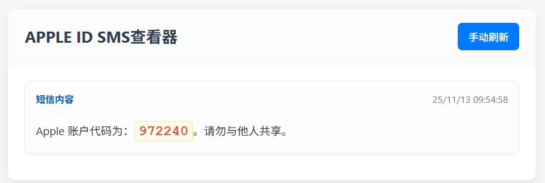

# Google Voice 短信转发查看器

这是一个轻量级的自动化项目，旨在将 Google Voice (GV) 收到的短信（特别是验证码）自动转发并显示在一个私有的、自托管的网页上。

它解决了需要手动登录 GV 或 Gmail 查看验证码的麻烦，为您提供了一个干净、私密、自动刷新的查看界面。



## ✨ 主要功能

* **自动转发**: 通过 Google Apps Script 自动监控 Gmail，实时推送新短信。
* **私有化部署**: 完全托管在您自己的 VPS 上，确保数据私密。
* **实时查看**: 前端页面每 5 秒自动刷新，无需手动操作。
* **智能过滤**: 自动解析邮件正文，移除所有垃圾链接和签名，只显示干净的短信内容。
* **验证码高亮**: 自动高亮显示 4-8 位的数字验证码。
* **自动清理**: 服务器只在内存中保留最新的 N 条短信（可配置），旧短信自动删除。
* **排序正确**: 始终确保最新的短信显示在页面最上方。

## 🛠️ 技术栈 (用到的工具)

* **推送端 (Forwarder)**: **Google Apps Script (GAS)**
* **后端 (Backend)**: **Python 3**
    * **Flask**: 轻量级 Web 框架，用于提供 API 和网页。
    * **Gunicorn**: 生产级的 WSGI 服务器，用于运行 Flask 应用。
* **前端 (Frontend)**: **HTML5, CSS3, JavaScript**
    * 使用 `Fetch API` 进行异步数据请求。
* **服务器 (Deployment)**:
    * **Linux VPS** (本项目在 Ubuntu/Debian 上测试)
    * **Nginx**: 高性能反向代理，用于处理 HTTPS 和转发请求。
    * **Systemd**: Linux 服务管理器，用于保证 Gunicorn 后台 7x24 运行。
    * **Certbot**: 自动获取和续订 Let's Encrypt 的 SSL 证书。
    * **uv**: (可选) 高性能 Python 包管理器。

## 🚀 架构流程

本项目分为两个主要的数据流：

1.  **数据推送流 (GAS -> Python)**:
    `GV 短信` -> `Gmail` -> `Google Apps Script (每分钟检查)` -> `HTTP POST` -> `Nginx` -> `Gunicorn (Flask App)` -> `存入内存列表`

2.  **数据读取流 (Browser -> Python)**:
    `浏览器` -> `HTTP GET` -> `Nginx` -> `Gunicorn (Flask App)` -> `读取内存列表` -> `返回 JSON`

## 📚 使用说明 (部署指南)

### 前提条件

1.  一台 **Linux VPS** (例如 Ubuntu 22.04)。
2.  一个**域名** (例如 `your-domain.com`)，并已将其 A 记录解析到您的 VPS IP。
3.  一个 **Google Voice 账户**，并已设置将短信转发到您的 **Gmail**。

---

### 第 1 步：部署后端 (Python VPS)

1.  **克隆或上传项目**:
    将本项目文件上传到您的 VPS，推荐放在 `/var/www/` 目录下。
    ```bash
    # 假设项目放在 /var/www/gv-flask
    cd /var/www/gv-flask
    ```

2.  **安装 Python 和 uv**:
    ```bash
    sudo apt update
    sudo apt install python3 python3-dev -y
    curl -Lsf [https://astral.sh/uv/install.sh](https://astral.sh/uv/install.sh) | sh
    source $HOME/.local/bin/env
    ```

3.  **创建虚拟环境并安装依赖**:
    ```bash
    # 更改目录所有权
    sudo chown $USER:$USER /var/www/gv-flask
    
    # 创建 .venv 文件夹
    uv venv
    
    # 激活环境
    source .venv/bin/activate
    
    # 安装依赖
    uv pip install flask gunicorn
    ```

4.  **配置 `app.py`**:
    打开 `app.py` 文件，您可以根据需要修改 `MAX_MESSAGES = 50` 这个值，来决定保留多少条历史记录。

---

### 第 2 步：配置 Nginx (反向代理)

1.  **安装 Nginx**:
    ```bash
    sudo apt install nginx -y
    ```

2.  **创建 Nginx 配置文件**:
    将 `your-domain.com` 替换为您的域名。
    ```bash
    sudo nano /etc/nginx/sites-available/your-domain.com
    ```

3.  **粘贴以下配置**:
    ```nginx
    server {
        listen 80;
        listen [::]:80;
        server_name your-domain.com; # <-- 替换为您的域名

        location / {
            # 将所有请求转发到 Gunicorn
            proxy_pass [http://127.0.0.1:8000](http://127.0.0.1:8000);
            proxy_set_header Host $host;
            proxy_set_header X-Real-IP $remote_addr;
            proxy_set_header X-Forwarded-For $proxy_add_x_forwarded_for;
            proxy_set_header X-Forwarded-Proto $scheme;
        }
    }
    ```

4.  **激活配置**:
    ```bash
    # 替换为您的域名
    sudo ln -s /etc/nginx/sites-available/your-domain.com /etc/nginx/sites-enabled/
    sudo rm /etc/nginx/sites-enabled/default
    sudo nginx -t
    sudo systemctl restart nginx
    ```

---

### 第 3 步：配置 Systemd (7x24 运行)

1.  **创建服务文件**:
    ```bash
    sudo nano /etc/systemd/system/gv-flask.service
    ```

2.  **粘贴以下配置**:
    *(请确保 `User` 和 `WorkingDirectory` / `Environment` / `ExecStart` 路径与您的设置匹配)*
    ```ini
    [Unit]
    Description=Gunicorn instance to serve gv-flask
    After=network.target

    [Service]
    User=root # <-- 替换为您的 VPS 用户名 (例如 root 或 ubuntu)
    Group=www-data
    WorkingDirectory=/var/www/gv-flask
    Environment="PATH=/var/www/gv-flask/.venv/bin"
    
    # 启动 Gunicorn，使用 1 个工人
    ExecStart=/var/www/gv-flask/.venv/bin/gunicorn --workers 1 \
                                                  --bind 127.0.0.1:8000 \
                                                  app:app
    Restart=always

    [Install]
    WantedBy=multi-user.target
    ```

3.  **启动服务**:
    ```bash
    sudo systemctl daemon-reload
    sudo systemctl start gv-flask
    sudo systemctl enable gv-flask
    ```
    您可以使用 `sudo systemctl status gv-flask` 检查运行状态。

---

### 第 4 步：启用 HTTPS (Certbot)

1.  **安装 Certbot**:
    ```bash
    sudo apt install certbot python3-certbot-nginx -y
    ```

2.  **运行 Certbot**:
    ```bash
    # 替换为您的域名
    sudo certbot --nginx -d your-domain.com
    ```
    * 在提示中，输入您的电子邮件。
    * 同意服务条款。
    * 当询问是否重定向 HTTP 到 HTTPS 时，选择 **2 (Redirect)**。

---

### 第 5 步：配置 Google Apps Script (数据推送)

1.  访问 [script.google.com](https://script.google.com)。
2.  创建一个新项目。
3.  将本项目中 `google_apps_script/forwarder.gs` (即我们最终的 GAS 脚本) 的内容粘贴到代码编辑器中。
4.  **[关键]** 修改 `SERVER_API_URL` 变量，将其值替换为您自己的域名：
    ```javascript
    const SERVER_API_URL = "https://your-domain.com/api/new-sms"; 
    ```
5.  **[关键]** 检查 `query` 变量，确保它符合您的过滤需求（例如 `newer_than:1d is:unread`）。
6.  点击顶部的“**运行**” (▶️) 按钮。
7.  在弹出的窗口中授权。您可能需要点击 “**高级**” -> “**转至 [项目名称] (不安全)**” -> “**允许**”。
8.  点击左侧的“**触发器**” (⏰) 图标。
9.  点击“**添加触发器**”。
10. 设置如下:
    * **要运行的函数**: `checkGmailAndForward`
    * **事件来源**: `时间驱动`
    * **类型**: `分钟计时器`
    * **间隔**: `每 1 分钟`
11. 点击“**保存**”。

部署完成！现在，当您的 Gmail 收到新的 GV 短信时，它应该会在 1 分钟内自动出现在您的网页上。
